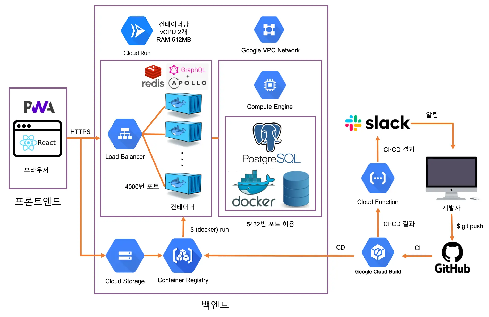

# ☁️ 소복 (Sobok) Back-End

소소한 행복 :)

2021년 8월 11일 (수) ~ ing

## 구성원

|  이름  |                      GitHub                      |        역할        |
| :----: | :----------------------------------------------: | :----------------: |
| 곽태욱 | [@rmfpdlxmtidl](https://github.com/rmfpdlxmtidl) | 프로젝트 초기 설정 |
| 김효진 |       [@hy57in](https://github.com/hy57in)       |                    |

## 개발 환경

- macOS 11.2
- [Git](https://git-scm.com/downloads) 2.32
- [Node](https://hub.docker.com/_/node) LTS Alpine
- [Yarn](https://yarnpkg.com/getting-started/install#about-global-installs) 1.22
- [Visual Studio Code](https://code.visualstudio.com/Download) 1.58
- [PostgreSQL](https://hub.docker.com/_/postgres) Alpine
- [Redis](https://hub.docker.com/_/redis) Alpine
- [Docker](https://www.docker.com/get-started) 20.10
- Docker Compose 1.29

```bash
$ git --version
$ node --version
$ yarn --version
$ code --version
$ docker --version
$ docker-compose --version
```

위 명령어를 통해 프로젝트에 필요한 모든 프로그램이 설치되어 있는지 확인합니다.

## 프로젝트 구조



## 설치 방법

### 프로젝트 다운로드

```bash
$ git clone 프로젝트-주소
$ cd 프로젝트-폴더
$ git checkout 브랜치-이름
$ yarn
```

프로젝트를 다운로드 받고 해당 폴더로 이동한 후 적절한 브랜치(`main` 등)로 이동하고 프로젝트에 필요한 외부 패키지를 설치합니다.

그리고 프로젝트 폴더에서 VSCode를 실행하면 오른쪽 아래에 '권장 확장 프로그램 설치' 알림이 뜨는데, 프로젝트에서 권장하는 확장 프로그램(ESLint, Prettier 등)을 모두 설치합니다.

### PostgreSQL 서버 실행

```bash
$ docker volume create {도커볼륨이름}
$ docker run \
  -d \
  -e POSTGRES_USER={DB계정이름} \
  -e POSTGRES_PASSWORD={DB계정비밀번호} \
  -e POSTGRES_DB={DB이름} \
  -e LANG=ko_KR.utf8 \
  -e LC_COLLATE=C \
  -e POSTGRES_INITDB_ARGS=--data-checksums \
  -p 5432:5432 \
  -v {도커볼륨이름}:/var/lib/postgresql/data \
  --name postgres \
  --restart=always \
  postgres:alpine
```

도커 명령어를 통해 PostgreSQL 서버 컨테이너와 볼륨을 생성합니다.

```bash
$ psql --host={호스트주소} --user={DB계정이름} --dbname={DB이름}
```

그리고 PostgreSQL 서버에 접속해서 [`database/sql/initialization.sql`](database/sql/initialization.sql)에 있는 SQL DDL을 실행합니다.

### Redis 서버 실행

```bash
$ docker run \
  -d \
  -p 6379:6379 \
  --name redis \
  --restart=always \
  redis:alpine
```

GraphQL API 서버를 로컬 Node.js 환경에서 실행하는 경우에만 Redis 서버를 컨테이너 환경에서 따로 실행해줍니다.

반면 GraphQL API 서버를 [컨테이너 환경](#배포-모드-컨테이너)에서 실행하는 경우에는 Redis 서버를 따로 실행하지 않아도 됩니다.

### 환경 변수 설정

```
POSTGRES_HOST=
POSTGRES_USER=
POSTGRES_PASSWORD=
POSTGRES_DB=

JWT_SECRET_KEY=

GOOGLE_CLIENT_ID=
GOOGLE_CLIENT_SECRET=

FACEBOOK_APP_ID=
FACEBOOK_APP_SECRET=

FRONTEND_URL=
BACKEND_URL=

PORT=4000
```

루트 폴더에 `.env` (또는 `.env.development`) 파일을 생성하고 거기에 프로젝트에 필요한 환경 변수를 설정합니다.

### 개발 모드

```bash
$ yarn dev
```

TypeScript 파일을 그대로 사용해 Nodemon으로 서비스를 실행합니다.

### 배포 모드

```bash
$ yarn build
$ yarn start
```

TypeScript 파일을 JavaScript로 트랜스파일한 후 Node.js로 서비스를 실행합니다.

### 배포 모드 (컨테이너)

```bash
$ docker-compose up --detach --build --force-recreate
```

Cloud Run 환경이랑 동일한 Docker 환경을 생성합니다.

### 브라우저 실행

```
http://localhost:4000/graphql
```

브라우저에서 아래 주소로 접속하면 개발 중인 사이트를 볼 수 있습니다.

### Cloud Run 배포

Cloud Run이 GitHub 저장소 변경 사항을 자동으로 감지하기 때문에 GitHub로 commit을 push할 때마다 Cloud Run에 자동으로 배포됩니다.

## 데이터베이스 ERD

[database/erd.html](https://teamsindy20.github.io/sobok-backend/database/erd.html)
